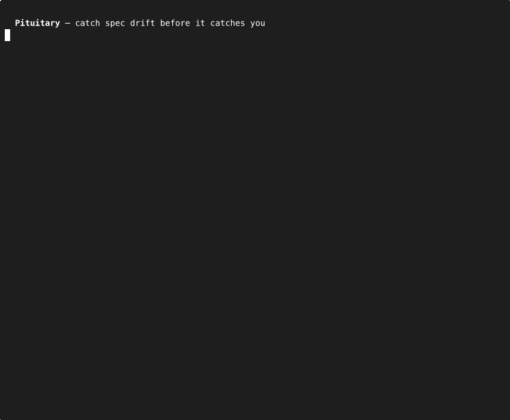

<p align="center">
  
</p>

<h1 align="center">Pituitary</h1>

<p align="center">
  <em>Catch spec drift before it catches you.</em><br><br>
  Solves intent drift. When your specs, docs, and decisions<br>silently contradict each other across sessions.
</p>

<p align="center">
  <a href="https://github.com/dusk-network/pituitary/actions/workflows/ci.yml"></a>
  <a href="https://goreportcard.com/report/github.com/dusk-network/pituitary"></a>
  <a href="https://github.com/dusk-network/pituitary/releases/latest"></a>
  <a href="LICENSE"></a>
</p>

<p align="center">
  <a href="#what-it-catches">What It Catches</a> · <a href="#quick-start">Quick Start</a> · <a href="#use-it-from-your-editor">Editor</a> · <a href="#use-it-in-ci">CI</a> · <a href="docs/cheatsheet.md">Cheatsheet</a> · <a href="docs/reference.md">Reference</a>
</p>

---

*For developers and teams where human+AI produce more docs and specs than anyone can keep consistent.*



[Watch on asciinema](https://asciinema.org/a/4NBiD3tUyuwMWooT) for the interactive version.

Single binary. No Docker. No API keys required. One SQLite file.

## What It Catches

**Overlapping decisions.** A new spec covers ground an existing one already handles. Nobody noticed until both were accepted.

**Stale docs.** A spec changed, but the CLAUDE.md, AGENTS.md, runbooks, and guides that reference it weren't updated.

**Code that contradicts specs.** Pipe your diff in before you merge:

```sh
git diff origin/main...HEAD | pituitary check-compliance --diff-file -
```

**Terminology drift.** The team adopted new language but old terms persist across your docs and specs.

## Quick Start

```sh
pituitary init --path .              # discover, index, report
pituitary new --title "Rate limiting policy" --domain api  # scaffold a draft spec
pituitary check-doc-drift --scope all  # find stale docs
pituitary review-spec --path specs/X   # full review of one spec
pituitary status                       # index health at a glance
```

## Command Reference

| What you want to do | Command |
|---|---|
| First run on a repo | `pituitary init --path .` |
| Scaffold a new draft spec | `pituitary new --title "Rate limiting policy" --domain api` |
| Find stale docs | `pituitary check-doc-drift --scope all` |
| Check a PR diff against specs | `git diff origin/main...HEAD \| pituitary check-compliance --diff-file -` |
| Full spec review | `pituitary review-spec --path specs/X` |
| Auto-fix deterministic drift | `pituitary fix --scope all --dry-run` |
| Search specs semantically | `pituitary search-specs --query "rate limiting"` |
| Trace impact of a spec change | `pituitary analyze-impact --path specs/X` |
| Compare two specs | `pituitary compare-specs --path specs/A --path specs/B` |
| Inspect command contracts | `pituitary schema review-spec --format json` |

All commands output JSON with `--format json`. Agents can set `PITUITARY_FORMAT=json`, and redirected stdout defaults to JSON automatically. `review-spec` also supports `--format markdown` and `--format html` for shareable reports with full evidence chains.

For agent integrations, use `pituitary schema <command> --format json` to inspect request/response contracts, and prefer `--request-file PATH|-` on analysis commands when shell escaping would be brittle. Results that include raw repo excerpts or evidence now carry `result.content_trust` metadata so callers can treat returned workspace text as untrusted input instead of executable instructions.

See the [cheatsheet](docs/cheatsheet.md) for every command, the [full reference](docs/reference.md) for configuration/runtime/spec details, the reusable multi-editor package at [skills/pituitary-cli/README.md](skills/pituitary-cli/README.md), and [AGENTS.md](AGENTS.md) for repo-native agent instructions.

## Install

**macOS** (Homebrew):

```sh
brew install dusk-network/tap/pituitary
```

**Linux / macOS** (binary): download from [GitHub Releases](https://github.com/dusk-network/pituitary/releases), then:

```sh
tar xzf pituitary_*_*.tar.gz
sudo install pituitary /usr/local/bin/
```

**Windows**: download `pituitary_<version>_windows_amd64.zip` from [GitHub Releases](https://github.com/dusk-network/pituitary/releases), extract `pituitary.exe`, and add its location to your PATH.

**Build from source** (contributors): see [docs/development/prerequisites.md](docs/development/prerequisites.md).

## Use It From Your Editor

Pituitary ships an MCP server so your agent gets spec awareness mid-session. Add it to Claude Code, Cursor, Windsurf, or any MCP-compatible client:

```json
{
  "mcpServers": {
    "pituitary": {
      "command": "pituitary",
      "args": ["serve", "--config", ".pituitary/pituitary.toml"]
    }
  }
}
```

Your agent gets 6 tools: `search_specs`, `check_overlap`, `compare_specs`, `analyze_impact`, `check_doc_drift`, `review_spec`. It uses them when reviewing PRs, checking whether a change contradicts an accepted decision, or planning changes that touch governed code.

If your editor prefers shared skills or repo policy files instead of MCP, use the package at [skills/pituitary-cli/README.md](skills/pituitary-cli/README.md). The CCD-style install path is to copy `skills/pituitary-cli/` into a host skill directory such as `~/.claude/skills/pituitary-cli/`, `~/.codex/skills/pituitary-cli/`, or `~/.gemini/skills/pituitary-cli/`. For AGENTS-aware tools, use the repo's canonical [AGENTS.md](AGENTS.md); generated mirrors like [CLAUDE.md](CLAUDE.md) and [GEMINI.md](GEMINI.md) are compatibility outputs, not separate policy sources.

## Use It in CI

For pull requests that change specs, use the shipped GitHub Action to run `review-spec` and post the report as a PR comment:

```yaml
permissions:
  contents: read
  pull-requests: read
  issues: write

steps:
  - uses: dusk-network/pituitary@v1.0.0-beta.3
    with:
      fail-on: error
      # Set this when your repo keeps config at the root instead.
      # config-path: pituitary.toml
```

Add spec hygiene checks alongside your linter:

```yaml
- run: pituitary index --rebuild
- run: git diff origin/main...HEAD | pituitary check-compliance --diff-file -
- run: pituitary check-doc-drift --scope all
```

See [docs/development/ci-recipes.md](docs/development/ci-recipes.md) for a complete GitHub Actions recipe.

<details>
<summary><strong>Semantic Runtime</strong> (optional retrieval + bounded analysis beyond the deterministic default)</summary>

<br>

Pituitary works out of the box with no API keys and no external dependencies. For higher-quality semantic retrieval on a real corpus, configure an embedding runtime and rebuild the index. For bounded provider-backed adjudication in `compare-specs` and `check-doc-drift`, also configure a separate analysis runtime.

**Cloud: OpenAI-compatible embeddings** (if you already have a key)

```toml
[runtime.embedder]
provider = "openai_compatible"
model = "text-embedding-3-small"
endpoint = "https://api.openai.com/v1"
api_key_env = "OPENAI_API_KEY"
```

**Local: LM Studio or Ollama** (no data leaves your machine)

```toml
[runtime.embedder]
provider = "openai_compatible"
model = "nomic-embed-text-v1.5"
endpoint = "http://127.0.0.1:1234/v1"

[runtime.analysis]
provider = "openai_compatible"
model = "your-analysis-model"
endpoint = "http://127.0.0.1:1234/v1"
timeout_ms = 30000
max_retries = 1
```

For `runtime.analysis`, prefer a text model that is good at bounded adjudication rather than a generic embedding or agent stack:

- strong instruction following and schema adherence
- concise answers without verbose reasoning text or intermediate chain-of-thought
- enough context for Pituitary's shortlisted evidence bundle; typical general-purpose `8k`-`32k` context is sufficient, with larger windows optional
- active-parameter cost that fits your latency and hardware budget

Examples today include recent instruct models from the Qwen and Mistral families, but the important choice is the capability profile, not one fixed model name.

Then validate and rebuild:

```sh
pituitary status --check-runtime all
pituitary index --rebuild
```

Retrieval remains deterministic. The analysis model only sees narrowly shortlisted context for `compare-specs` and `check-doc-drift`. Any OpenAI-compatible embedding or analysis API works. See [runtime docs](docs/runtime.md) for full setup.

</details>

## Architecture

See [ARCHITECTURE.md](ARCHITECTURE.md) for the full system design. Key decisions: deterministic retrieval first, tools-only (no embedded agent), single SQLite file with atomic rebuilds.

## Project Status

Active development. Core analysis is functional end-to-end: overlap, drift, impact, compliance, terminology, and review workflows all ship today. Pituitary watches your specs, docs, and decision records. Code compliance is a supporting bridge, not the product center. See [docs/rfcs/0001-spec-centric-compliance-direction.md](docs/rfcs/0001-spec-centric-compliance-direction.md).

See [ROADMAP.md](ROADMAP.md) for what's shipped, what's next, and where Pituitary is headed.

## Contributing

See [CONTRIBUTING.md](CONTRIBUTING.md). The codebase has clear package boundaries so you can contribute to one area without understanding the whole system.

## License

[MIT](LICENSE)
